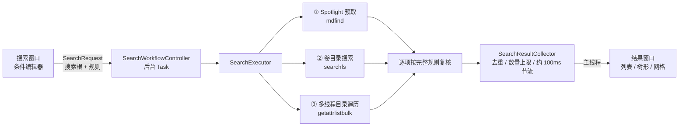

# FileHound

一个使用 Swift + AppKit 开发的 macOS 文件搜索工具，目标体验接近 Find Any File。

## 当前能力

- 代码化主窗口与自定义菜单
- 查询模型与执行计划
- Spotlight 预取、卷目录搜索（searchfs）、多线程目录遍历与文本内容搜索
- 列表/树形结果浏览与预览面板
- 已保存搜索与偏好设置窗口
- 主题切换与语言热切换
- 权限诊断与特权 Helper 骨架
- Sparkle 更新入口与 DMG / appcast 脚本

## 运行原理

FileHound 不维护自己的索引：没有常驻后台进程，不占额外磁盘，每次搜索看到的都是磁盘此刻的真实状态。一次搜索的完整链路如下：



1. **收集规则**：搜索窗口把“搜索范围 + 若干条件”组装成 `SearchRequest`。条件之间是“且”的关系；“启动卷”“所有磁盘”等范围由 `SearchScopeResolver` 展开为搜索根和排除路径（如 `/Volumes`、`/System/Volumes`）。
2. **Spotlight 预取**（`SpotlightSearchService`，受“包含 Spotlight 结果”偏好控制）：规则能翻译成 Spotlight 查询时，先用 `mdfind -onlyin` 取回一批候选。Spotlight 不区分大小写，而且不收录系统目录、隐藏文件、包内容等，所以这批结果只用来尽快给出第一屏，每一条仍按完整规则复核。文本内容搜索如果 Spotlight 已有结果就直接返回，因为它的索引覆盖 PDF、Office 等非纯文本格式。
3. **卷目录搜索**（`LocalVolumeCatalogSearcher`）：如果搜索根本身是一个卷（启动卷或外置磁盘），并且有一条名称类规则能提取出名称中必然出现的一段文字，就用 `searchfs` 让内核直接扫描卷的目录，取回“名称包含该片段”的候选，再用 `fsgetpath` 还原成路径。启动卷会同时搜索 System 卷、Data 卷以及遍历时会进入的嵌套卷（如 cryptex 挂载点）。某个卷不支持 `searchfs`（如网络卷、FAT）时，这个卷自动改为遍历。
4. **多线程目录遍历**（`DirectoryWalker`）：其他情况，或者设置了“限制文件夹深度”时，从搜索根开始多线程遍历目录树。遍历途中按偏好中的“特殊文件夹”（`SpecialFolderPlanner`）跳过或包含指定目录；“不可见项目”条件为否时，隐藏目录整棵跳过，不再往下列。
5. **逐项判定**：卷目录搜索和遍历共用同一个判定函数。先看排除路径与特殊文件夹，再按“只看路径的规则 → 需要读属性的规则 → 需要读内容的规则”的顺序逐条判定，任何一条不满足就立即放弃。只有命中的条目才去读取完整属性，生成结果行。
6. **汇总与流式展示**：`SearchResultCollector` 在多个线程之间按路径去重，执行“限制数量”，并把进度回调节流到约 100ms 一次送回主线程，所以搜索过程中结果窗口是持续刷新的，不用等全部结束。点击停止时，遍历线程每 50ms、`searchfs` 每 200ms 检查一次取消标记。

## 为什么查找这么快

不建索引还能快，靠的是尽量少做系统调用、把 I/O 并行起来，以及能不读的就不读。下面各项的倍数都来自后文的 [Benchmark](#benchmark)。

### 1. 用 `getattrlistbulk` 批量列目录

常见写法是先 `readdir` / `contentsOfDirectory` 拿到名字，再对每个子项 `stat` / `attributesOfItem` 判断它是不是文件夹，每个文件至少一次系统调用。`BulkDirectoryLister` 改用 `getattrlistbulk`：一次系统调用把一批子项的“名称 + 类型”直接填进 128KB 缓冲区，遍历只需要这两项信息。

> 同样单线程遍历 `/System/Library`（约 46 万个条目），换成批量读取后从 46.8s 降到 5.7s，快了约 **8 倍**。

### 2. 多个线程共享一个待遍历目录栈

`DirectoryWalker` 启动 `min(CPU 核数, 8)` 个工作线程，共享一个待列目录栈：每个线程取一个目录，列出子项、判定、把子目录压回栈里，再取下一个。用一个“未完成目录计数”判断何时结束，计数归零就说明遍历完成。用栈（深度优先）而不是队列，待处理目录的数量不会膨胀，内存占用平稳。在 APFS SSD 上实测 8 个线程吞吐最高，再多反而因为锁和 I/O 竞争变慢。

> 在批量读取的基础上开 8 个线程，又从 5.7s 降到 1.5s；整体比 BSD `find` 快约 **7.7 倍**，比 `FileManager.enumerator` 快约 **11 倍**。

### 3. 用 `searchfs` 直接扫描卷目录

搜索整个磁盘时，逐个目录“打开 → 列出 → 关闭”的开销是大头。`searchfs` 是 macOS 的系统调用（Find Any File 也用它），由内核在文件系统的目录结构中线性扫描，按名称片段匹配（不区分大小写），用户态不需要打开任何目录。FileHound 的做法：

- 多个卷并发搜索，每次调用最多在内核里停留 200ms，到时先把已找到的结果交出来。这样界面可以分批刷新，也能及时响应取消。
- APFS 的对象 ID 超过 32 位，取 64 位 `ATTR_CMN_FILEID` 交给 `fsgetpath` 还原完整路径。
- 搜索期间卷有写入时，续搜会返回 `EBUSY`，此时从头重来，最多 3 次，重复项由结果汇总去重。
- `searchfs` 只做“名称包含片段”的粗筛（返回超集），每个候选仍走与遍历完全相同的判定，保证两条路径的结果一致。忽略变音符号时，规则中带变音符号的字符，以及大小写映射会改变长度的字符（如 `ß`），都会作为切分点，只取安全的片段交给内核。

> 搜索整个启动卷（约 707 万个对象）时，卷目录搜索比 8 线程遍历快约 **1.5 倍**（31.9s 对 48.5s）。APFS 上 `searchfs` 是对整个卷目录的线性扫描，耗时取决于卷上的对象总数，与命中数无关。它的优势在于不依赖逐个目录的读取权限和目录缓存：遍历进不去的目录（如缺少“完全磁盘访问权限”时 `~/Library` 下的部分目录），卷目录搜索也能找到其中的条目。

### 4. 廉价规则先判，属性按需读取

- 规则按判定成本排序：名称、扩展名、路径这类只看字符串的规则排在前面，修改日期、大小、类型等需要读属性的居中，标签、注释其次，文本内容、脚本最后。
- 属性只在某条规则需要时才读取，读过一次就缓存。绝大多数不命中的条目，除了批量列目录之外不会再多一次系统调用。
- 只有最终命中的条目才去读取 `resourceValues`（创建日期、标签、是否为包等）并生成结果行。

### 5. 内容搜索：按大小选读法，按字节预筛

- **读取**：不超过 64MB 的文件用 `pread` 一次读入，更大的文件用内存映射，并用 `madvise(MADV_SEQUENTIAL | MADV_WILLNEED)` 提示内核顺序预读。内存映射逐页缺页读入，每次 IO 只有几十 KB，未缓存时吞吐只有直接 `read` 的三分之一左右，所以小文件不用它。
- **匹配**：`ContentMatcher` 先用 `memmem` 按字节查找关键词的 UTF-8 / UTF-16 / Latin-1 编码，命中就直接确认。忽略大小写或变音符号时，先找关键词中不受折叠影响的最长一段：文件里连这一段都没有，就不可能匹配，直接排除。只有这些办法都无法定论时，才把内容解码成字符串比较。纯 ASCII 文件按字节忽略大小写查找，不做解码。

> 在 macOS SDK 的 Frameworks 目录（约 1.3 万个条目）中搜索一个标识符，比 BSD `grep -r` 快约 **9.7 倍**，与 ripgrep 处在同一量级（0.36s 对 0.31s）。

### 6. 先出结果，持续刷新

Spotlight 预取能在不到一秒内给出第一批结果，随后由卷目录搜索或遍历补全。结果汇总按约 100ms 节流推送到界面：命中密集时界面不会被刷新淹没，命中稀疏时也会在间隔结束后补发，最后一批结果不会被节流吞掉。

## Benchmark

基准测试与 App 用的是**同一份搜索引擎源码**（`DirectoryWalker`、`BulkDirectoryLister`、`LocalVolumeCatalogSearcher`、`ContentMatcher` 等），用 `swiftc -O` 编译成命令行程序，再与系统自带工具和朴素的 Foundation 实现对比。

```bash
./Scripts/benchmark.sh                     # 默认参数，结果同时写入 build/benchmark/result.md
./Scripts/benchmark.sh --runs 3 --skip-volume
./Scripts/benchmark.sh --tree-root ~/Projects --name readme --content-root ~/Projects --content TODO
```

默认的测试目录都是各台 Mac 上内容相同的系统目录（`/System/Library`、Xcode 自带 SDK），便于复现。

以下结果测于 2026-10-02，Apple M2 Max（12 核）、32 GB 内存、macOS 27.2。每个实现先预热 1 次，再取 3 次的中位数；目录与文件缓存都已热，预热就超过 10 秒的实现只计 1 次。

### 场景一：目录树按名称搜索

在 `/System/Library`（458,219 个条目）中查找名称包含 `plist` 的文件和文件夹（忽略大小写）。

| 实现 | 耗时 | 相对 `find` | 结果数 | 说明 |
| --- | ---: | ---: | ---: | --- |
| `find -iname` | 11.81 s | 1.0× | 35,699 | BSD find，单线程 |
| `FileManager.enumerator` | 17.08 s | 0.7× | 35,699 | Foundation 朴素实现，单线程 |
| 列名 + 逐项读属性 | 46.81 s | 0.3× | 35,699 | 与 FileHound 相同的遍历器，单线程，用 `contentsOfDirectory` + `attributesOfItem` |
| FileHound 单线程 | 5.69 s | 2.1× | 35,699 | `getattrlistbulk` 批量列目录 |
| **FileHound（App 默认）** | **1.52 s** | **7.7×** | 35,699 | `getattrlistbulk` + 8 线程 |
| `mdfind -onlyin` | 0.39 s | 不可比 | 2 | Spotlight 不收录 `/System`，结果几乎为空 |

### 场景二：整个启动卷按名称搜索

在启动卷（System + Data 卷约 707 万个对象，另有 4 个嵌套卷）中查找名称包含 `plist` 的条目，搜索范围与 App 中的“启动卷”一致。

| 实现 | 耗时 | 相对遍历 | 结果数 | 说明 |
| --- | ---: | ---: | ---: | --- |
| FileHound 遍历 | 48.49 s | 1.0× | 290,156 | `getattrlistbulk` + 8 线程，从 `/` 逐目录列出 |
| **FileHound 卷目录搜索（App 默认）** | **31.89 s** | **1.5×** | 295,472 | `searchfs` 并发扫描 6 个卷 |
| `mdfind -name` | 1.06 s | 不可比 | 11,430 | 只含 Spotlight 已索引的条目 |

两种方式的结果集不完全相同。遍历进不了当前进程无权访问的目录。卷目录搜索对有多个硬链接的文件只返回一个路径，在系统卷上较常见。

### 场景三：按文本内容搜索

在 Xcode 自带 `MacOSX.sdk/System/Library/Frameworks`（13,290 个条目）中查找内容包含 `kCFAllocatorDefault` 的文件。区分大小写，不使用 Spotlight，逐个读取文件。

| 实现 | 耗时 | 相对 `grep` | 结果数 | 说明 |
| --- | ---: | ---: | ---: | --- |
| `grep -rlF` | 3.51 s | 1.0× | 41 | BSD grep，单线程 |
| `rg -l -F -uuu` | 0.31 s | 11.3× | 41 | ripgrep，多线程，不跳过任何文件 |
| **FileHound（App 默认）** | **0.36 s** | **9.7×** | 42 | 8 线程遍历 + `pread` / `mmap` + `memmem` 预筛 |

FileHound 多出的 1 个结果是指向 `CoreFoundation.tbd` 的符号链接：FileHound 会读取指向文件的符号链接，`grep -r` 与 `rg` 默认跳过。

### 解读与局限

- 测的是**引擎核心**（列目录 / 卷搜索 + 规则匹配），不含 App 为每个命中项读取完整属性、生成结果行和渲染界面的开销。命中数很大时（如场景二的近 30 万条），App 中的实际耗时会更长。
- 所有数据都在**热缓存**下测得。冷缓存（刚开机，或执行过 `sudo purge`）时各实现都会明显变慢，其中遍历受随机读影响最大。
- 同一台机器上多次运行会受后台负载（Spotlight 索引、备份等）影响而波动，请以数量级和相对关系为准。
- Spotlight（`mdfind`）在有索引时最快，但不收录系统目录、隐藏文件、包内容和被排除的位置，所以 FileHound 只拿它预取第一批结果，最终结果仍以卷目录搜索或遍历为准。

## 本地开发

```bash
xcodegen generate
open FileHound.xcworkspace
xcodebuild -workspace FileHound.xcworkspace -scheme FileHound build -destination 'platform=macOS'
xcodebuild test -workspace FileHound.xcworkspace -scheme FileHound -destination 'platform=macOS' -only-testing:FileHoundTests
xcodebuild test -workspace FileHound.xcworkspace -scheme FileHound -destination 'platform=macOS' -only-testing:FileHoundUITests
```

`xcodegen generate` 会自动执行 `pod install`，然后再从 `FileHound.xcworkspace` 进入开发。

日常 UI 调试请始终从 `FileHound.xcworkspace` 的 `FileHound` scheme 启动。

如果引入 CocoaPods 后出现“能编译但看不到 App 窗口”，先检查 Xcode 顶部选中的 scheme 是否误切到了 `FileHoundHelper`。这个 target 是辅助 tool，不会拉起主界面。

如果 Xcode 仍然记住了错误的运行目标，可以在关闭 Xcode 后删除本地用户态状态文件，再重新打开 workspace：

```bash
rm -f FileHound.xcodeproj/project.xcworkspace/xcuserdata/"$USER".xcuserdatad/UserInterfaceState.xcuserstate
```

## 打包

```bash
./Scripts/build_dmg.sh --arch arm64
./Scripts/build_dmg.sh --arch x86_64
./Scripts/publish_github_release.sh \
  --dmg build/dmg/FileHound_v1.2.0_3_arm64.dmg \
  --dmg build/dmg/FileHound_v1.2.0_3_x86_64.dmg
./Scripts/generate_appcast.sh --arch arm64 --archive build/dmg/FileHound_v1.2.0_3_arm64.dmg
./Scripts/generate_appcast.sh --arch x86_64 --archive build/dmg/FileHound_v1.2.0_3_x86_64.dmg
```

说明：

- `./Scripts/build_dmg.sh` 必须显式传入 `--arch arm64` 或 `--arch x86_64`，默认从 `FileHound.xcworkspace` 归档对应架构的 `Release`，并执行 notarize + staple
- 如需仅本地测试 DMG，可使用 `./Scripts/build_dmg.sh --arch <arch> --no-notarize`
- `./Scripts/publish_github_release.sh` 支持重复传入 `--dmg`，将同一版本的多架构 DMG 一次上传到 GitHub Release `v<版本号>`
- `./Scripts/generate_appcast.sh` 必须显式传入 `--arch`，会把对应架构的 DMG 归档到 `build/appcast-archives/<arch>/`，并生成仓库根目录的 `appcast-<arch>.xml`
- 发布后仍需把更新后的 `appcast-arm64.xml` 和 `appcast-x86_64.xml` 提交并推送到默认分支
- 已安装旧 `1.0` 且缺失有效 Sparkle 元数据的机器，可能仍需要先手动升级一次，之后才会进入新的自动更新链路

发布前置条件：

- 已执行 `gh auth login`
- 本机存在 `vanjay_mac_stapler` notarytool profile
- 已生成 Sparkle 私钥：

```bash
<Sparkle bin>/generate_keys --account cn.vanjay.FileHound.sparkle
```

当前 Sparkle feed 地址为：

```text
arm64:   https://raw.githubusercontent.com/wangwanjie/FileHound/main/appcast-arm64.xml
x86_64:  https://raw.githubusercontent.com/wangwanjie/FileHound/main/appcast-x86_64.xml
```
